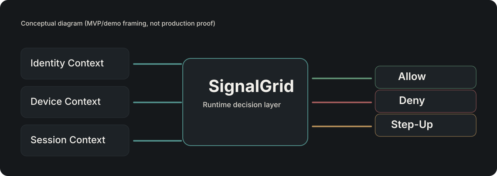

> # ⚠️ Legacy — retired POC / concept
>
> **This repository is a retired proof-of-concept (pre-dev / concept stage).**
> Active development has moved to the consolidated, canonical monorepo:
>
> → **[DanFashauer/SignalGrid-Review-Hub](https://github.com/DanFashauer/SignalGrid-Review-Hub)** (dev → alpha → beta → prod tiers; live demo, deterministic core, control plane, docs).
>
> This repo is kept for history only and is no longer maintained. Please use the canonical repo above.

---

# SignalGrid

<p align="left">
  
</p>



**SignalGrid is a Zero Trust orchestration platform for shared and mobile work environments.**

**Mission:** SignalGrid enables secure, contextual, real-time access by continuously evaluating identity, device trust, and operational context.

**Category framing:** SignalGrid sits between identity, device management, and operational workflows to make trust decisions at the moment of use.

## SignalGrid at a glance

- **What we do:** Orchestrate session trust decisions and downstream enforcement for shared and mobile environments.
- **Who we serve:** Regulated and high-consequence frontline organizations.
- **Why it matters:** Better risk control, operational resilience, productivity, and accountability without workflow-breaking friction.

## Brand and presentation direction

SignalGrid branding is being aligned to a premium enterprise style that matches the current product framing:

- Warm charcoal foundations, off-white typography, and muted teal accents
- Minimal, architectural visuals with restrained risk-state colors
- Runtime decision-layer positioning (not a generic identity/security dashboard)

See [docs/BRAND_SYSTEM.md](docs/BRAND_SYSTEM.md) and [startup/branding/brand.md](startup/branding/brand.md) for current guidance.

## The problem we solve

Shared and mobile devices in hospitals, warehouses, and other regulated environments are often used by multiple people across shifts and locations. Traditional controls often assume static trust, creating operational and security gaps between identity, device posture, context, and enforcement.

SignalGrid closes that gap by evaluating trust at session start and orchestrating deterministic downstream actions in real time.

## What SignalGrid is (and is not)

### SignalGrid is
- A trust-orchestration layer for access decisions on shared and mobile devices.
- A session decision platform combining identity, device posture, and context.
- An enforcement and governance orchestrator for connected systems (e.g., NAC, SIEM, ITSM).

### SignalGrid is not
- A replacement for your identity provider.
- A replacement for MDM/UEM device management.
- A replacement for NAC, SIEM, or ITSM platforms.
- A generic badge app or shared-device prototype.

## Who SignalGrid is for

SignalGrid is for organizations running regulated or high-consequence frontline operations where shared and mobile devices are mission-critical and every access decision must be fast, secure, and auditable.

Primary environments include:
- Healthcare delivery systems.
- Logistics and warehouse operations.
- Other regulated frontline work settings with strict operational accountability.

## Values

- **Trust is earned, never assumed.**
- **Security without workflow friction.**
- **Operational clarity over tool sprawl.**
- **Real-world context matters.**
- **Build for resilience and accountability.**

## Core platform pillars

- **Identity**: tie access decisions to real users and roles.
- **Trust**: evaluate device and session trust continuously, not by assumption.
- **Context**: include posture, location, and operational state in decisions.
- **Enforcement**: trigger deterministic actions across integrated systems.
- **Governance**: keep decisions auditable, explainable, and reviewable.

## Why it matters (business value)

SignalGrid maps directly to executive outcomes:

- **Reduce risk**
  - Deny non-compliant or unknown-posture sessions.
  - Apply step-up or restrictive controls when trust degrades.
  - Preserve auditable decision and event trails.
- **Improve operations**
  - Reduce shared-device login friction.
  - Align session behavior to frontline context.
  - Make cross-shift device workflows more predictable.
- **Increase productivity**
  - Support faster tap-in to task-specific access.
  - Reduce repeated authentication burden in shared workflows.
  - Minimize frontline disruption while maintaining control.
- **Strengthen compliance and resilience**
  - Improve session governance evidence quality.
  - Increase posture-aware policy consistency.
  - Support continuity through explicit decision and orchestration paths.
- **Differentiate the business**
  - Connect identity, device trust, and real-world context in one control loop.
  - Enable modern frontline workflows without weakening controls.

See [docs/VALUE_MAP.md](docs/VALUE_MAP.md) for the concise executive mapping.

## Example use cases

- **Healthcare**: protect shared clinical devices while preserving shift-based workflow speed.
- **Logistics / warehouse**: enforce posture-aware access on handhelds and station devices.
- **Regulated frontline environments**: apply policy-based access and action orchestration where accountability is mandatory.

## High-level architecture

SignalGrid ingests session signals, evaluates policy and context, produces an explicit trust decision, and orchestrates action execution.

```text
Identity + Badge + Device/Posture + Location Context
                      |
                      v
               SignalGrid Core
         (session, policy, context, mode)
                      |
                      v
      Trust Decision: ALLOW | DENY | STEP_UP
                      |
                      v
 Integrations + Governance (NAC / SIEM / ITSM / Audit)
```

See [docs/ARCHITECTURE_OVERVIEW.md](docs/ARCHITECTURE_OVERVIEW.md) for the evolving architecture model.

## Business-facing docs

- [Claim boundaries](docs/CLAIM_BOUNDARIES.md) — safe language for MVP, demo, pilot, and production claims.
- [Value map](docs/VALUE_MAP.md) — executive, IT/security, workflow, audit, and pilot-metric mapping.
- [Product board](docs/PRODUCT_BOARD.md) — current MVP, demo confidence, pilot readiness, future roadmap, and non-goals.
- [Integration priorities](docs/INTEGRATION_PRIORITIES.md) — current demo integrations, first real targets, later targets, and safety boundaries.
- [Architecture future notes](docs/ARCHITECTURE_FUTURE_NOTES.md) — future gateway, remediation, AI-assist, guardrails, and non-goals.

## Current repository status

- **Demo-ready**: Yes — includes demo control scripts, demo validation flow, and demo-oriented tests.
- **Pilot-ready**: In progress — production hardening, Docker validation in a Docker-capable environment, and operational maturity work are tracked in roadmap docs.

## Repository structure

```text
src/                 Next.js app, API routes, policy/runtime logic, integrations
scripts/             Demo, simulation, seed, and validation scripts
docs/                Architecture, value mapping, terminology, demo and validation docs
tests/               API, demo, security, e2e, and load test suites
ios/                 iOS prototype and enterprise shell artifacts
startup/             Early-stage positioning, branding, pitch, and planning docs
```

## Getting started

These steps are based on scripts currently defined in `package.json`.

1. Install dependencies:
   - `npm install`
2. Run the app locally:
   - `npm run dev`
3. Run core checks:
   - `npm run lint`
   - `npm run typecheck`
   - `npm run test:run`
4. Run demo flows (optional):
   - `npm run demo:up`
   - `npm run demo:exec`
   - `npm run demo:validate`

Additional script options are available in `package.json` for API tests, security tests, e2e tests, and integration simulations.

## Production operations

SignalGrid includes a production container path and launch runbook for operating the product as a managed service or customer-hosted deployment after target-environment validation. See [docs/PRODUCTION_RUNBOOK.md](docs/PRODUCTION_RUNBOOK.md) for release gates, required environment variables, container deployment, health checks, and incident rollback steps. Docker build/run commands should be validated in a Docker-capable environment before customer deployment.

The public integration compatibility surface is available under `/api/v1/*` for health, devices, events, metrics, session start, and location reporting workflows.

## Security note

Demo and development paths are intentionally optimized for speed and validation. They are not equivalent to hardened production controls, and demo outputs are simulated unless explicitly configured otherwise. Production deployment requires strict key management, signed data paths, environment hardening, operational guardrails, and signed pilot or customer deployment scope. See [docs/DISCLAIMER.md](docs/DISCLAIMER.md).

## Roadmap preview

Near-term priorities include readiness hygiene, removal of remaining unsafe defaults, package/toolchain normalization, demo verification, and pilot readiness milestones. See [docs/ROADMAP.md](docs/ROADMAP.md) and [docs/READINESS_HYGIENE_STATUS.md](docs/READINESS_HYGIENE_STATUS.md).

## Contributing

Contributions are welcome via pull requests focused on clarity, security posture, test coverage, integration reliability, and operational quality.

## License

No license file is currently present in this repository. Add a `LICENSE` file before distributing outside internal or private use.
